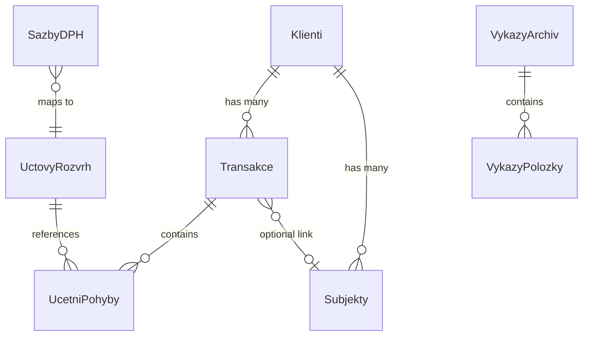

# Multi-Finance — Project Overview

## 1. Purpose & Scope

**Multi-Finance** is a **multi-tenant double-entry accounting system** built for Czech businesses. It provides a complete workflow for recording financial transactions, computing VAT obligations, generating official Czech financial statements (Balance Sheet, Income Statement, Cash Flow), performing year-end closings, and exporting reports to PDF — all through a browser-based dashboard.

The system is designed around the **Czech Chart of Accounts** (Účtová osnova) and complies with Czech accounting regulations, including:

- Double-entry validation (MD = D / Debit = Credit)
- VAT rates (21 %, 12 %, 0 %) with automatic DPH account routing
- Year-end closing procedures (accounts 702, 710, 701)
- Official financial statement templates (full-form Balance Sheet, Income Statement, Cash Flow)

---

## 2. Technology Stack

| Layer | Technology |
|---|---|
| **Language** | Python 3 |
| **UI Framework** | [Streamlit](https://streamlit.io/) |
| **Database** | Microsoft SQL Server (local instance via Windows Authentication) |
| **DB Driver** | `pyodbc` with ODBC Driver 17 |
| **Data Processing** | `pandas`, `decimal` |
| **Charting** | `plotly` (bar charts, trend lines) |
| **PDF Export** | `fpdf2` |
| **Config** | `python-dotenv` for environment variables |

---

## 3. Directory Structure

```
Multi-Finance/
├── config/
│   └── settings.py              # DB connection settings (server, database name)
├── core/
│   ├── __init__.py
│   ├── database.py              # Database connection class + generic query executor
│   ├── models.py                # ORM-like models: Transakce, UcetniPohyb
│   └── accounting_logic.py      # AccountingEngine — the central business logic (1,887 lines)
├── db_setup/
│   ├── __init__.py
│   ├── 001_initial_sql_schema.sql   # DDL script: tables, constraints, seed data
│   └── setup_db.py              # Script to execute the schema against the DB
├── ui/
│   ├── __init__.py
│   ├── app.py                   # Main Streamlit application (1,613 lines)
│   └── f_statements.py          # Financial statements UI + PDF generator
├── utils/
│   └── etl.py                   # Placeholder for future ETL pipelines (currently empty)
└── requirements.txt             # Dependency list (currently empty — see note below)
```

---

## 4. Database Schema

The system uses **6 core tables** plus several dynamically created tables. All data is scoped by `klient_id` for multi-tenancy.

### Core Tables (from DDL script)

| Table | Purpose |
|---|---|
| `Klienti` | Client registry (multi-tenancy root). Fields: `id`, `nazev_firmy`, `ico`, `datum_registrace`, `datum_uzaverky` |
| `UctovyRozvrh` | Chart of Accounts. Fields: `cislo` (account number), `nazev`, `typ_uctu` (A/P/N/V/Z/P*) |
| `Transakce` | Transaction headers (document date, due date, description, document number, soft-delete flag) |
| `UcetniPohyby` | Journal entries — individual debit/credit lines linked to a transaction |
| `SazbyDPH` | VAT rate configuration (percentage, type, input/output DPH accounts) |
| `AuditLog` | Change tracking (auto-created on first run if missing) |

### Dynamically Created Tables

| Table | Purpose |
|---|---|
| `Subjekty` | Business partners (name, email, phone, IČO) — used by the Dashboard |
| `VykazyArchiv` | Archive of generated financial statements |
| `VykazyPolozky` | Line items within archived statements |

### Entity Relationship



---

## 5. Core Module — `accounting_logic.py`

The `AccountingEngine` class (~1,900 lines) is the heart of the application. It is instantiated with a `klient_id` and provides all business logic.

### Key Method Groups

#### Transaction Management
| Method | Description |
|---|---|
| `save_transakce()` | Creates a new transaction with automatic VAT line splitting. Validates Czech accounting rules and period locks. |
| `upravit_transakci()` | Full transaction edit — updates header, deletes old journal entries, recreates new ones with recalculated VAT. |
| `get_transakce_detail()` | Loads complete transaction data (header + all journal lines) for the edit form. |

#### Account & Balance Queries
| Method | Description |
|---|---|
| `spocti_zustatky()` | Computes all account balances (MD − D) for a given date range. |
| `get_zustatek_uctu()` | Returns the balance of a single account. |
| `get_pohyby_uctu()` | Returns all journal movements for an account within a date range. |
| `get_report_data()` | Aggregated report: assets, liabilities, expenses, revenues, and net income. |

#### Chart of Accounts
| Method | Description |
|---|---|
| `inicializuj_uctovy_rozvrh()` | Seeds the full Czech Chart of Accounts (~200 accounts across classes 0–7). |
| `zajisti_existenci_uctu()` | Auto-creates an account if it doesn't exist (for manual/analytical input). |
| `get_zakladni_ucty_podle_tridy()` | Returns base (3-digit) accounts for a given class. |
| `get_analytika_pro_ucet()` | Returns sub-accounts (e.g., `501.001`) for a given base account. |

#### VAT (DPH)
| Method | Description |
|---|---|
| `get_dph_sazby()` | Loads VAT rates from DB as a dictionary: `{rate: {vstup, vystup}}`. |
| `spocti_prehled_dph()` | Computes the VAT summary (input vs. output) for a period. |

#### Year-End & Period Management
| Method | Description |
|---|---|
| `provest_rocn_uzaverku_komplet()` | Full year-end closing: transfers P&L to account 710, balance sheet to 702. |
| `otevrit_novy_rok()` | Opens a new fiscal year by creating opening balances from prior year's closing (701). |
| `zauctovat_dan_z_prijmu()` | Books corporate income tax (account 591/341) with automatic unique document numbering. |
| `zkontroluj_zda_je_otevreno()` | Enforces period locks — prevents changes to closed periods. |

#### Financial Statements
| Method | Description |
|---|---|
| `get_vykaz_podklady()` | Generates data for official statement templates (Balance Sheet, Income Statement, Cash Flow). Uses predefined row-to-account mappings. |
| `ulozit_vykaz_do_archivu()` | Persists a generated statement to the archive tables. |
| `get_minule_obdobi_netto()` | Retrieves prior-period values from the archive for comparative columns. |

#### Dashboard & Analytics
| Method | Description |
|---|---|
| `get_dashboard_data()` | Loads receivables and payables (accounts 311/321) with partner info for the dashboard. |
| `get_working_capital_metrics()` | Calculates gross, net, and liquid working capital. |
| `get_income_expense_trend()` | Monthly aggregation of revenues (class 6) and expenses (class 5). |

#### Validation
| Method | Description |
|---|---|
| `validuj_ceske_standardy()` | Enforces Czech accounting rules (e.g., no direct cash-to-cash transfers without account 261, inventory method A vs. B constraints). |

---

## 6. Data Models — `models.py`

Two simple ORM-style classes:

- **`Transakce`** — Transaction header with `pridat_pohyb()`, `validovat_podvojnost()` (MD = D check), and `ulozit_transakci()` (DB persistence with rollback on failure).
- **`UcetniPohyb`** — Single journal line: account, direction (`MD`/`D`), and amount.

> [!NOTE]
> These models are currently not heavily used by the UI — the `AccountingEngine` handles most DB operations directly via raw SQL.

---

## 7. User Interface — `app.py`

The Streamlit application provides **8 navigation modules** accessible via a sidebar:

### Module Overview

| Module | Function | Description |
|---|---|---|
| **Nová Transakce** | `formular_nova_transakce()` | Full transaction creation form with account class → base account → sub-account drill-down, manual mode for custom analytics, amount parsing (`1.5m`, `50k`), VAT selection, and double-entry validation. |
| **Přehled Účtů** | `zobrazit_prehled_uctu()` | Account overview with optional analytical detail toggle. Shows all accounts with balances and running P&L. |
| **Přehled DPH** | `zobrazit_prehled_dph()` | VAT dashboard: breakdown by rate, input vs. output, net obligation with colored status banner. |
| **Historie** | `zobrazit_historii_uctu()` | Transaction history with date/document/client search. Inline editing of headers and journal entries. Soft-delete to trash with restore capability. Permanent purge option. |
| **Reporty** | `zobrazit_reporty()` | Financial reports: Income Statement (P&L banner, expense/revenue breakdown) and Balance Sheet (balance check, assets/liabilities). |
| **Uzávěrka** | `zobrazit_uzaverku()` | Year-end management: income tax calculation & booking, annual closing (702), new year opening (701), period locking/unlocking. |
| **Finanční Dashboard** | `zobrazit_financni_dashboard()` | Interactive dashboard with Plotly charts: receivables/payables trend, income/expense bars, monthly balance, working capital metrics. Filterable by type, amount range, and text search. |
| **Účetní výkazy** | `f_statements.zobrazit_ucetni_zaznamy()` | Official Czech financial statements (Balance Sheet full form, Income Statement, Cash Flow) with editable data grids, archive system, and PDF export. |

### UI Features

- **Custom CSS theming** — Dark mode, glassmorphism containers, color-coded status banners, responsive mobile layout
- **Time filter component** — Reusable date range picker with preset buttons (Today, This Week, This Month, Q1–Q4, This Year)
- **Money formatting** — Unified `format_money()` function with Czech-style formatting (`1 234 567.89 Kč`)
- **Smart input parsing** — Accepts `1.5m`, `50k`, `50 000` as amount inputs
- **Soft-delete architecture** — Transactions are flagged `is_deleted = 1` (trash), with restore and permanent purge options

---

## 8. Financial Statements Module — `f_statements.py`

### Statement Generation

Uses predefined **template skeletons** and **account-to-row mappings** (defined in `accounting_logic.py`) to populate official Czech financial statement forms:

- **`SABLONA_AKTIVA_FULL`** — 81-row Balance Sheet (Assets) template
- **`SABLONA_PASIVA_FULL`** — 68-row Balance Sheet (Liabilities & Equity) template
- **`SABLONA_VYSLEDOVKA_FULL`** — 56-row Income Statement template
- **`SABLONA_CF_FULL`** — 28-row Cash Flow Statement template

Each template row maps to specific synthetic accounts via `MAPOVANI_*` dictionaries.

### PDF Export

The `FinancialPDF` class (extending `fpdf2.FPDF`) generates downloadable PDF reports with:
- Company header (name, IČO, date)
- Tabular data with bold highlighting for subtotals (EBITDA, EBIT, EBT, EAT)
- Czech currency formatting

### Archive System

Generated statements can be saved to the database (`VykazyArchiv` + `VykazyPolozky` tables), browsed by year/type, edited inline, re-exported to PDF, or deleted.

---

## 9. Database Layer — `database.py`

- **`Database` class** — Context manager (`with Database() as conn:`) for pyodbc connections using Windows Authentication (`Trusted_Connection=yes`).
- **`execute_query()` function** — Generic query executor that auto-detects `SELECT` vs. DML statements, returns results or commits accordingly.
- Connection string targets a local SQL Server instance: `ONDRA\SQLSERVER` / database `UcetniSystemDB`.

---

## 10. Configuration — `settings.py`

Minimal configuration file loading environment variables via `python-dotenv`:

```python
DB_SETTINGS = {
    'SERVER': r'ONDRA\SQLSERVER',
    'DATABASE': 'UcetniSystemDB',
}
```

---

## 11. Current Limitations & Notes

| Area | Status |
|---|---|
| `requirements.txt` | **Empty** — dependencies need to be listed (`streamlit`, `pyodbc`, `pandas`, `plotly`, `fpdf2`, `python-dotenv`) |
| `utils/etl.py` | **Empty placeholder** — reserved for future ETL/data import pipelines |
| Multi-user auth | Not implemented — single hardcoded `KLIENT_ID = 1` |
| Duplicate method definitions | `opravit_strukturu_rozvrhu()`, `get_seznam_uctu()`, `get_ucet_nazev()`, and `provest_uctovani_uzaverky_710()` are defined twice in `accounting_logic.py` (the second definition silently overrides the first) |
| Error handling | Some `except: pass` blocks suppress errors silently |
| Inventory method B | Year-end inventory operations are implemented but not exposed in the UI |

---

## 12. How to Run

```bash
# 1. Ensure SQL Server is running and accessible
# 2. Initialize the database schema
python db_setup/setup_db.py

# 3. Launch the Streamlit application
streamlit run ui/app.py
```

> [!IMPORTANT]
> The application requires a running MS SQL Server instance with Windows Authentication enabled. The connection targets `ONDRA\SQLSERVER` — update `config/settings.py` for your environment.
